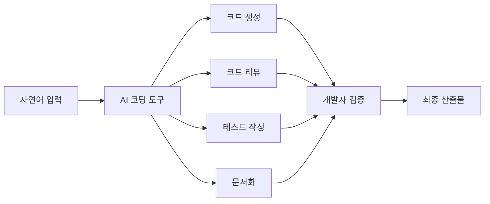
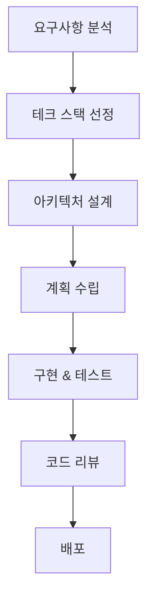
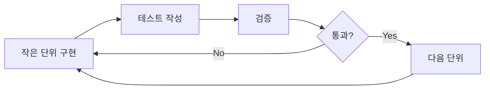

# 바이브 코딩 가이드

> **버전**: 2026.1
> **최종 업데이트**: 2026-01-15

---

## 목차

1. [이 문서의 목적](#1-이-문서의-목적)
2. [바이브 코딩의 정의](#2-바이브-코딩의-정의)
3. [핵심 원칙](#3-핵심-원칙)
4. [도구](#4-도구)
5. [프롬프팅](#5-프롬프팅)
6. [워크플로우](#6-워크플로우)
7. [품질 관리](#7-품질-관리)
8. [보안](#8-보안)
9. [협업](#9-협업)
10. [팁 & 유용한 리소스](#10-팁--유용한-리소스)

---

## 1. 이 문서의 목적

빠르게 변화하는 AI 코딩 도구 환경에서 개발자들이 일관된 품질과 생산성을 유지할 수 있도록 돕기 위해 작성되었다.

이 문서 자체도 주기적으로 업데이트될 예정이며, 특정 버전에 대한 참조는 Git 태그를 통해 관리된다.

---

## 2. 바이브 코딩의 정의

현 시점의 바이브 코딩은 단순히 자연어로 코드를 생성하는 것이 아니라, **AI 도구를 최대한 활용하여 개발 생산성을 극대화하는 방법론**을 총칭한다.



---

## 3. 핵심 원칙

### 3.1 기존 소프트웨어 개발 방법론은 여전히 유효하다

바이브 코딩은 기존의 소프트웨어 개발과 다르지 않다. 기존 소프트웨어 개발의 모범 사례와 안티패턴이 공유된다.

- SOLID 원칙
- 클린 코드
- TDD
- 디자인 패턴
- 애자일
- 데브옵스

이러한 방법론들이 여전히 유효하다. 하지만 앞으로도 그러리라는 보장은 없다.

### 3.2 모던 소프트웨어 엔지니어링의 가속화

바이브 코딩은 기존 소프트웨어 개발, 특히 [모던 소프트웨어 엔지니어링](https://www.davefarley.net/?p=352)에 필요한 여러 활동들을 적은 비용으로 빠르게 수행할 수 있게 해준다.

### 3.3 신뢰할 수 있는 프로세스를 만들어라

> **AI를 믿지 말라! 사람도 믿지 말라! 신뢰할 수 있는 프로세스를 만들어라!**

AI가 생성한 코드는 반드시 검증되어야 한다. 사람이 작성한 코드도 마찬가지다. 중요한 것은 검증 가능한 프로세스를 구축하는 것이다.

### 3.4 생산성 공식

바이브 코딩에 있어서 AI나 도구만으로 낼 수 있는 생산성은 고정된 수치에 가까우며 한계가 있다. 개발자 자신의 역량과 올바른 도구, 프로세스가 결합되었을 때 비로소 생산성이 증폭된다.

```
바이브 코딩 생산성 = 개발자 역량 × AI 도구와 프로세스의 생산성
```

- 개발자 역량이 없이는 AI 도구의 생산성도 제한적이다
- 바이브 코딩의 생산성은 **증가**되는 것이 아니라 **증폭**되는 것이다

### 3.5 개발자 역량의 재정의

개발자 역량에서 코드 작성 능력이 차지하는 비중이 빠르게 줄고 있다. 코더로서의 능력보다는 다음 역량의 비중이 커지고 있다:

- 문제 해결 능력
- 도메인 지식
- 아키텍처 설계 능력
- 프로세스 설계 능력
- 보안에 대한 지식

우리는 프로그래밍 언어를 다루지 않는 소프트웨어 개발자의 시대를 준비해야 한다.

---

## 4. 도구

### 4.1 AI 코딩 도구 현황

현시점에서는 종합적인 능력에 있어서 **Claude(모델) / Claude Code(개발도구)**가 가장 우수하다. Claude / Claude Code의 발전 속도 또한 빠르기 때문에 경쟁자들과 6개월 정도의 차이를 유지하고 있다.

하지만 시장은 치열하며 경쟁자들도 만만치 않기 때문에 주기적인 평가가 필요하다.

| 도구 | 특징 | 적합한 용도 |
|-----|------|-----------|
| Claude Code | 종합적 능력 우수, 긴 context 지원 | 복잡한 프로젝트, 대규모 리팩토링 |
| Cursor | IDE 통합, 빠른 응답 | 일상적인 코딩 작업 |
| GitHub Copilot | 광범위한 IDE 지원 | 코드 자동완성, 간단한 작업 |

### 4.2 프로그래밍 언어

<!-- TODO: 언어별 AI 도구 지원 현황 추가 -->

---

## 5. 프롬프팅

### 5.1 의도를 전달하라

요청뿐만 아니라 **의도**를 전달하라. [XY 문제](https://xyproblem.info/)는 문제 해결에 있어서 중요한 개념이며, 바이브 코딩에 있어서는 특히 그러하다.

**나쁜 예:**
```
리스트를 역순으로 정렬해줘
```

**좋은 예:**
```
사용자에게 최신 항목을 먼저 보여주고 싶어.
현재 리스트가 생성일 오름차순으로 정렬되어 있는데,
이를 최신순으로 보여주려면 어떻게 해야 할까?
```

### 5.2 AI에게 질문을 허락하라

앤트로픽의 엔지니어가 제안한 [방법론](https://x.com/trq212/status/2005315275026260309)은 매우 유용하다.

프롬프트에 다음과 같은 문구를 추가하는 것을 고려하라:
```
작업을 시작하기 전에 명확하지 않은 부분이 있다면 질문해줘.
```

### 5.3 반복 프롬프트 관리

반복적으로 발생하는 프롬프트를 어떻게 관리할 것인가? Claude Code에는 다음 기능들을 제공한다:

- **에이전트**: 특정 작업을 수행하는 자동화된 워크플로우
- **커맨드**: 자주 사용하는 프롬프트의 단축 명령
- **훅**: 특정 이벤트에 반응하는 자동화
- **스킬**: 재사용 가능한 능력 모듈
- **플러그인**: 위 기능들을 손쉽게 관리

이러한 기능들을 적극 활용하라.

---

## 6. 워크플로우

### 6.1 기본 워크플로우



### 6.2 단계별 AI 활용

| 단계 | AI 활용 방법 |
|-----|-------------|
| 요구사항 분석 | 요구사항 명확화, 엣지 케이스 도출 |
| 아키텍처 설계 | 설계 대안 제시, 트레이드오프 분석 |
| 계획 수립 | 태스크 분해, 의존성 파악 |
| 구현 | 코드 생성, 리팩토링 |
| 테스트 | 테스트 케이스 생성, 테스트 코드 작성 |
| 코드 리뷰 | 자동 리뷰, 개선점 제안 |

---

## 7. 품질 관리

### 7.1 점진적 구현과 테스트

확인이 가능한 단위로 나누어서 구현과 테스트를 동시에 진행한다.



### 7.2 자동화된 테스트와 CI/CD

- 단위 테스트 자동화
- 통합 테스트 파이프라인 구축
- 지속적 배포 환경 구성
- AI를 활용한 테스트 커버리지 분석

---

## 8. 보안

### 8.1 Zero Data Retention (ZDR) 모드

민감한 프로젝트에서는 반드시 **ZDR 모드**를 활성화하라. 이는 AI 제공자가 입력 데이터를 학습에 사용하지 않도록 보장한다.

### 8.2 보안 리뷰 자동화

- AI를 활용한 보안 취약점 스캔
- OWASP Top 10 체크리스트 자동 검증
- 시크릿 노출 방지 자동화

### 8.3 주의사항

- API 키, 비밀번호 등 민감 정보를 프롬프트에 포함하지 않는다
- `.env` 파일은 반드시 `.gitignore`에 추가한다
- AI가 생성한 코드의 보안 취약점을 반드시 검토한다

---

## 9. 협업

### 9.1 오너십 재정의

AI가 코드 작성의 상당 부분을 담당하게 되면서, 코드 오너십에 대한 재정의가 필요하다.

- 코드 작성자 → 코드 검증자/책임자
- 개인 소유 → 팀 공동 소유

### 9.2 프로세스와 프롬프트 공유

프로세스와 프롬프트는 팀 전체가 공유해야 한다.

- Claude 플러그인을 통한 팀 설정 공유
- 프롬프트 라이브러리 구축
- 베스트 프랙티스 문서화

### 9.3 지식 공유

- 사내 바이브 코딩 커뮤니티를 만들어서 모범 사례를 적극적으로 공유
- 페어 프로그래밍이나 몹 프로그래밍을 적극 활용
- 정기적인 회고와 개선

---

## 10. 팁 & 유용한 리소스

### 10.1 공식 자료

수시로 업데이트되는 앤트로픽의 공식 문서와 튜토리얼, 기술 블로그를 주시하라.

- [Anthropic Documentation](https://docs.anthropic.com/)
- [Claude Code Documentation](https://docs.anthropic.com/en/docs/claude-code)

### 10.2 커뮤니티

- [Reddit Anthropic Forum](https://www.reddit.com/r/Anthropic/)
- [긱뉴스](https://news.hada.io/)

### 10.3 추천 팔로우

- **Armin Ronacher** - Flask 개발자
- **Boris Cherny** - Claude Code 개발자

이들의 트위터, 유튜브, 블로그를 팔로우하면 최신 인사이트를 얻을 수 있다.

---

## 변경 이력

| 버전 | 날짜 | 변경 내용 |
|-----|------|----------|
| 2026.1 | 2026-01-15 | 초기 버전 작성 |
