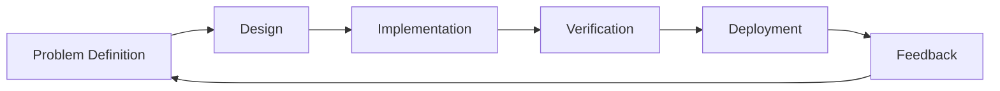

# Vibe Coding Guide

Maximizing Development Productivity with AI Tools

**Version 2026.1**

---

## About the Speaker

- Working as a developer for 30 years since 1995
- AI transformation consulting and education
- Intensive vibe coding experiments from November 2024 to January 2026
- GitHub: [@serithemage](https://github.com/serithemage)

---

## Agenda

1. What is Vibe Coding?
2. Core Principles
3. Tools and Environment
4. Effective Prompting
5. Workflow
6. Quality Management
7. Security
8. Team Collaboration

---

## 1. What is Vibe Coding?

Beyond Simple Code Generation

- Utilizing AI across design, implementation, verification, documentation, and operations
- Core focus: Shortening problem definition and hypothesis validation loops
- Emphasis on decision-making speed over code writing speed

---

## Scope of Vibe Coding



AI accelerates every stage

---

## 2. Core Principles

Continuation of Existing Software Development

- SOLID, TDD, design patterns remain valid
- AI is a catalyst for faster iteration of these practices
- Acceleration of modern software engineering

---

## Trustworthy Processes

> **Don't trust AI, don't trust humans either!**

- Automated testing
- Automated code review
- Automated backup routines

Verifiable processes are key

---

## Productivity Formula

```
Vibe Coding Productivity =
  Developer Competency × AI Tools & Process Productivity
```

- Multiplication effect: Higher competency amplifies AI impact
- Problem-solving ability matters more than coding skills
- Domain knowledge, architecture, process, security competencies

---

## Redefining Developer Competency

From Coder to Problem Solver

- Problem definition ability
- Domain knowledge
- Architecture design
- Process design
- Security knowledge

---

## 3. Tools and Environment

**Current Best: Claude + Claude Code**

- Evaluated as 6 months ahead of competitors
- However, quarterly reassessment needed
- Market is rapidly changing

---

## YOLO Mode

Bold Execution + Solid Safety Net

- Automated verification over manual human review
- Try fast, rollback fast
- CI/CD, IaC, monitoring essential

---

## Language Selection

**Go + TypeScript/React**

Why Go is suitable for vibe coding:
- Fast compilation (immediate verification)
- Static typing (early error detection)
- Concise syntax (easy for AI to understand)
- Excellent performance (prototype→production)

Multiplatform: Flutter/Dart

---

## CLI vs MCP

**CLI Preferred**

- Easy script automation
- Lower token usage

**Minimal MCP Usage**
- Perplexity MCP (research)
- Context7 MCP (latest documentation)

---

## 4. Effective Prompting

**Communicate Intent**

Bad example:
```
Sort the list in reverse order
```

Good example:
```
I want to show users the latest items first.
Currently, the list is sorted by creation date ascending.
What's the best approach?
```

---

## XY Problem

- X: The real problem you're trying to solve
- Y: Your proposed solution

**Share X, don't just ask about Y**

Convey hidden intent, constraints, and success criteria

---

## Allow AI to Ask Questions

```
Before starting the task,
please ask if anything is unclear.
```

- Loop for AI to confirm requirements
- Clarification over guessing

---

## Managing Repetitive Prompts

**Leverage Claude Code Features**

- Agents
- Commands
- Hooks
- Skills
- Plugins

Version control in repository for team sharing

---

## 5. Workflow

```
Requirements Analysis
  ↓
Architecture Design
  ↓
Planning
  ↓
Implementation/Verification/Deployment Loop ←┐
  ↓                                          │
Regular Review/Refactoring ──────────────────┘
```

---

## Implementation/Verification/Deployment Loop

Fast Feedback is Key

1. Generate code with AI
2. Run tests immediately
3. Linter, security scan
4. Deploy (local/dev/staging)
5. Verify actual behavior

---

## Regular Reviews

Technical Debt Management

- Once a week
- At sprint end
- Review entire codebase
- Refactor improvements

---

## 6. Quality Management

**Break into Small Units**

- Decompose into verifiable units
- Write tests for each unit
- Verify immediately

Prevent problem accumulation, maintain always-working state

---

## Automated Verification

**Leverage Git/Claude Code Hooks**

- Unit Tests (UT)
- Lint
- Security Scan
- CI/CD Pipeline

Safety net for YOLO mode

---

## 7. Security

**ZDR Mode Essential**

Zero Data Retention
- Code not used as training data
- Essential for sensitive projects
- Recommended for personal projects too

---

## Automated Security Review

**Pipeline Integration**

- SAST/DAST tools
- AI-based code scanners
- OWASP Top 10 checks
- Secret detection

Specify security policies in prompts

---

## 8. Team Collaboration

**Redefining Ownership**

Code Author → Code Verifier/Owner

- Developer responsible even if AI writes
- Individual ownership → Team collective ownership
- Broader coverage, higher consistency needed

---

## Sharing Prompts and Processes

**Manage as Team Assets**

- Share Claude plugins
- Version control in repository
- Build prompt library
- Document best practices

---

## Knowledge Sharing

**Vibe Coding Community**

- Regular meetings: Share experiences
- Pair/mob programming
- Archive session logs
- Fast onboarding for newcomers

---

## Key Resources

**Official Materials**
- [Anthropic Research](https://www.anthropic.com/research)
- [Claude Code Documentation](https://code.claude.com/docs/en/overview)
- [Anthropic News](https://www.anthropic.com/news)

**Community**
- [Reddit r/Anthropic](https://www.reddit.com/r/Anthropic/)
- [GeekNews](https://news.hada.io/)

---

## Core Messages

1. **AI is the catalyst, developers are the amplifier**
2. **Trust the process**
3. **Break small and verify fast**
4. **Grow together with the team**

---

## Q&A

Questions welcome

---

## References

- Documentation: [GitHub Repository](https://github.com/roboco-io/vibe-coding-recommendations)
- Author: [@serithemage](https://github.com/serithemage)
- License: MIT

This guide is a living document.
Feedback and contributions are welcome.
