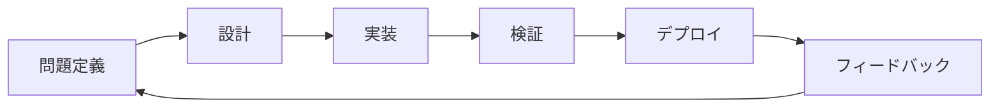

# Vibe Codingガイド

AIツールを活用した開発生産性の最大化

**バージョン 2026.1**

---

## 発表者紹介

- 1995年から30年間開発者として活動
- AIトランスフォーメーションコンサルティングと教育
- 2024年11月〜2026年1月 vibe coding集中実験
- GitHub: [@serithemage](https://github.com/serithemage)

---

## 目次

1. Vibe Codingとは？
2. 核心原則
3. ツールと環境
4. 効果的なプロンプティング
5. ワークフロー
6. 品質管理
7. セキュリティ
8. チームコラボレーション

---

## 1. Vibe Codingとは？

単純なコード生成を超えて

- 設計、実装、検証、ドキュメント化、運用全般でAIを活用
- 問題定義と仮説検証ループの短縮が核心
- コード作成速度より意思決定速度に集中

---

## Vibe Codingの範囲



すべての段階でAIが加速化

---

## 2. 核心原則

既存ソフトウェア開発の連続線

- SOLID、TDD、デザインパターンは依然として有効
- AIはこれらの実践をより速く繰り返させる触媒
- モダンソフトウェアエンジニアリングの加速化

---

## 信頼できるプロセス

> **AIを信じるな、人も信じるな！**

- 自動化されたテスト
- 自動化されたコードレビュー
- 自動化されたバックアップルーチン

検証可能なプロセスが核心

---

## 生産性の公式

```
Vibe Coding生産性 =
  開発者の能力 × AIツール・プロセスの生産性
```

- 乗数効果：能力が高いほどAIが増幅
- コード作成能力より問題解決力が重要
- ドメイン知識、アーキテクチャ、プロセス、セキュリティ能力

---

## 開発者能力の再定義

コーダーから問題解決者へ

- 問題定義能力
- ドメイン知識
- アーキテクチャ設計
- プロセス設計
- セキュリティ知識

---

## スピードが何よりも重要

**高速フィードバックループ**

- 集中力の維持とより多くの実験
- パイプライン全体のボトルネック最小化
- キャッシュの積極的活用
- 待機時間の排除

プログラミング言語を直接扱わない時代への準備

---

## 3. ツールと環境

**現在最善：Claude + Claude Code**

- 競合と比較して6ヶ月先行していると評価
- しかし四半期ごとに再評価が必要
- 市場は急速に変化中

---

## YOLOモード

大胆な実行 + 堅実な安全網

- 人による手動レビューより自動化された検証
- 素早く試して素早くロールバック
- CI/CD、IaC、モニタリング必須

---

## 言語選択

**Go + TypeScript/React**

Goがvibe codingに適している理由：
- 高速なコンパイル（即時検証）
- 静的型付け（エラーの早期発見）
- 簡潔な構文（AIが理解しやすい）
- 優れたパフォーマンス（プロトタイプ→プロダクション）

マルチプラットフォーム：Flutter/Dart

---

## コンテナとデータベース

**コンテナ**
- 安定した開発とデプロイをサポート
- 一貫した環境を保証

**データベース**
- 目的に合わせて選択
- 迅速なプロトタイピング：SQLiteを推奨
- プロトタイプ→プロダクション移行が容易

---

## CLI vs MCP

**CLI優先**

- スクリプト自動化が容易
- トークン使用量が少ない

**MCP最小使用**
- Perplexity MCP（調査）
- Context7 MCP（最新ドキュメント）

---

## 4. 効果的なプロンプティング

**意図を伝える**

悪い例：
```
リストを逆順にソートして
```

良い例：
```
ユーザーに最新の項目を最初に表示したい。
現在リストが作成日昇順なんだけど、
最善の方法は何？
```

---

## XY問題

- X：本当に解決したい問題
- Y：自分が考えた解決方法

**Xを共有せよ、Yだけ聞くな**

隠れた意図、制約、成功基準を一緒に伝える

---

## AIに質問を許可する

```
作業を始める前に
不明確な部分があれば質問してください。
```

- AIが要件を確認するループ
- 推測より明確化

---

## 反復プロンプト管理

**Claude Code機能活用**

- Agents
- Commands
- Hooks
- Skills
- Plugins

リポジトリでバージョン管理してチーム共有

---

## 5. ワークフロー

```
要件分析
  ↓
アーキテクチャ設計
  ↓
計画立案
  ↓
実装/検証/デプロイループ ←┐
  ↓                      │
定期レビュー/リファクタリング ─┘
```

---

## 実装/検証/デプロイループ

高速フィードバックが核心

1. AIでコード生成
2. 即座にテスト実行
3. リンター、セキュリティスキャン
4. デプロイ（ローカル/開発/ステージング）
5. 実際の動作確認

---

## 定期レビュー

技術的負債管理

- 週に一度
- スプリント終了時
- コードベース全体レビュー
- 改善部分のリファクタリング

---

## Vibe Codingへの移行

**既存プロジェクトから移行する際の必須事前作業**

1. ドキュメント化
2. 自動化テストの導入
3. CI/CDパイプラインの構築

堅固な基盤の上でvibe codingを開始

---

## 6. 品質管理

**小さな単位に分割**

- 確認可能な単位に分解
- 各単位ごとにテスト作成
- 即座に検証

問題蓄積防止、常に動作する状態維持

---

## 自動化された検証

**Git/Claude Code Hooks活用**

- 単体テスト（UT）
- Lint
- セキュリティスキャン
- CI/CDパイプライン

YOLOモードの安全網

---

## 7. セキュリティ

**ZDRモード必須**

Zero Data Retention
- コードが学習データとして使用されない
- 機密プロジェクトで必須
- 個人プロジェクトでも推奨

---

## 自動化されたセキュリティレビュー

**パイプライン統合**

- SAST/DASTツール
- AIベースのコードスキャナー
- OWASP Top 10チェック
- シークレット検出

プロンプトにセキュリティポリシーを明示

---

## 8. チームコラボレーション

**オーナーシップの再定義**

コード作成者 → コード検証者/責任者

- AIが書いても開発者が責任
- 個人所有 → チーム共同所有
- 広がったカバレッジ、高まった一貫性が必要

---

## プロンプトとプロセスの共有

**チーム資産として管理**

- Claude pluginsの共有
- リポジトリでバージョン管理
- プロンプトライブラリ構築
- ベストプラクティスの文書化

---

## 知識共有

**Vibe Codingコミュニティ**

- 定期ミーティング：経験共有
- ペア/モブプログラミング
- セッションログ保管
- 新人の迅速なオンボーディング

---

## 主要リソース

**公式資料**
- [Anthropic Research](https://www.anthropic.com/research)
- [Claude Code文書](https://code.claude.com/docs/en/overview)
- [Anthropic News](https://www.anthropic.com/news)

**コミュニティ**
- [Reddit r/Anthropic](https://www.reddit.com/r/Anthropic/)
- [GeekNews](https://news.hada.io/)

---

## 核心メッセージ

1. **AIは触媒、開発者は増幅器**
2. **プロセスを信頼せよ**
3. **小さく分けて速く検証せよ**
4. **チームと共に成長せよ**

---

## Q&A

質問歓迎します

---

## 参考資料

- ドキュメント：[GitHub Repository](https://github.com/roboco-io/vibe-coding-recommendations)
- 作成者：[@serithemage](https://github.com/serithemage)
- ライセンス：MIT

このガイドは生きたドキュメントです。
フィードバックと貢献を歓迎します。
